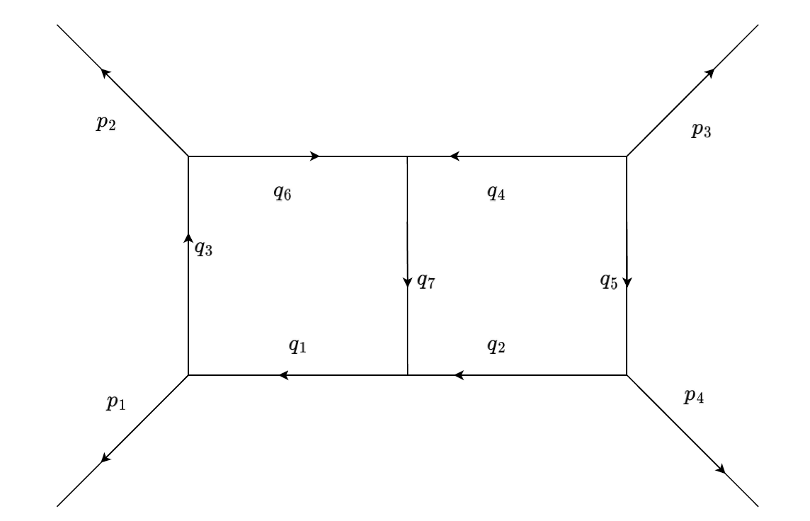

```@meta
CurrentModule = Feynman
```
# Example : Fully massless planar double box


To provide an example of how to use our library, we calculate the set of reduced IBP-system for the target integrals $I(1,1,1,-1,-3,-1,-1,-1,-1)$ and $I(1,-1,1,-1,-3,-1,-1,-4,-1)$ correspond to the fully massless planar double box given in figure 6.
We assume the compatible Singular version is installed and the library "feynman.lib" is downloaded from the git repository provided in chapter one.
```singular
    LIB "C:\\path_to\\Singular_Feynman\\feynman.lib";

```

First, the corresponding graph needs to be set.
There are $9$ Baikov variables in the Baikov representation, which can be seen when computing the Baikov matrix.
```singular
>graph G = makeGraph(list(1,2,3,4,5,6),list(list(6,1),list(4,6),list(1,2),
list(3,5),list(4,3),list(2,5),list(5,6),list(1),list(2),list(3),list(4)));
 G;
```
**Output:**
```singular
[[6, 1], [4, 6], [1, 2], [3, 5], [4, 3], [2, 5], [5, 6], [1], [2], [3], [4]]
Graph with 6 vertices, 7 bounded edges and 4 unbounded edges
```

Target integrals need to be set as a list:
```singular 
> list targetInt=list(list(1,1,1,-1,-3,-1,-1,-1,-1),list(1,-1,1,-1,-3,-1,-1,-4,-1));
```

Then, one can call the procedure \verb|getReducedIBPSystem()| to compute the reduced IBP system and the corresponding master integrals.
```singular
    list finalset=getReducedIBPSystem(G,targetInt);
```

Provided target integrals belong to the same integral family.

It will then show the computational time for each sector computation before returning the output values.\\
**Output:**
```singular
    Assignment of Baikov variables:
z(1)=>q(1)^2
z(2)=>q(2)^2
z(3)=>q(1)^2-2*p(1)*q(1)
z(4)=>q(2)^2-2*p(2)*q(2)-2*p(1)*q(2)+2*p(1)*p(2)
z(5)=>q(2)^2-2*p(3)*q(2)-2*p(2)*q(2)-2*p(1)*q(2)
z(6)=>q(1)^2-2*p(2)*q(1)-2*p(1)*q(1)+2*p(1)*p(2)
z(7)=>q(2)^2-2*q(1)*q(2)+q(1)^2
z(8)=>p(1)*q(2)
z(9)=>p(3)*q(1)
------------------------------------------------------------------------------
Started the computation in the sector:1 at layer 1.
time elapsed for the computation of  module intersection: 0
Elapsed time to set the matrix over Fp in seconds:1
Elapsed time to compute rref in seconds:0. size of the matrix:37 * 57
completed the computation in the sector:1 at layer 1.
------------------------------------------------------------------------------
Started the computation in the sector:1 at layer 2.
time elapsed for the computation of  module intersection: 0
Elapsed time to set the matrix over Fp in seconds:1
Elapsed time to compute rref in seconds:0. size of the matrix:35 * 51
completed the computation in the sector:1 at layer 2.
------------------------------------------------------------------------------
Started the computation in the sector:2 at layer 2.
time elapsed for the computation of  module intersection: 0
Elapsed time to set the matrix over Fp in seconds:111
Elapsed time to compute rref in seconds:231. size of the matrix:661 * 468
completed the computation in the sector:2 at layer 2.
------------------------------------------------------------------------------
Started the computation in the sector:3 at layer 2.
time elapsed for the computation of  module intersection: 0
Elapsed time to set the matrix over Fp in seconds:5
Elapsed time to compute rref in seconds:4. size of the matrix:208 * 96
completed the computation in the sector:3 at layer 2.
------------------------------------------------------------------------------
Started the computation in the sector:1 at layer 3.
time elapsed for the computation of  module intersection: 0
Elapsed time to set the matrix over Fp in seconds:112
Elapsed time to compute rref in seconds:230. size of the matrix:743 * 397
completed the computation in the sector:1 at layer 3.
------------------------------------------------------------------------------
Started the computation in the sector:2 at layer 3.
time elapsed for the computation of  module intersection: 0
Elapsed time to set the matrix over Fp in seconds:6
Elapsed time to compute rref in seconds:5. size of the matrix:220 * 99
completed the computation in the sector:2 at layer 3.
------------------------------------------------------------------------------
Started the computation in the sector:3 at layer 3.
time elapsed for the computation of  module intersection: 0
Elapsed time to set the matrix over Fp in seconds:356
Elapsed time to compute rref in seconds:2645. size of the matrix:3019 * 579
completed the computation in the sector:3 at layer 3.
>
```

The returned list has two entries; the first is the setIBP containing the reduced IBP system. One can see its size and IBP relations as follows:

```singular
    > setIBP S=finalset[1];
    > ring R=S.over;
    > setring R;
```


```singular
    > size(S.IBP);
    1319
```

There are 1059 independent IBP relations. Before reduction, there were $3019+220+743+208+661+35+37=4923$. Since the finite field row reduction is involved, one can verify the result by running the procedure a few times. 

```singular
     > oneIBP I=S.IBP[5];
     > I;
  
    (2*t(1)*D-20*t(1))I(0,1,1,-1,-3,-1,-1,-2,-1)
    +(-t(1)*D-12*t(1))I(0,1,1,-1,-4,-1,-1,-1,-1)
    +(-t(1)*D-8*t(1)-t(2)*D-8*t(2))I(0,1,1,-2,-3,-1,-1,-1,-1)
    +(-4*t(1))I(0,1,0,-1,-3,-1,-1,-1,-1)+(-2*t(1)*D
    -6*t(1)+t(2)*D+10*t(2))I(0,0,1,-1,-3,-1,-1,-1,-1)
    +(-2*t(1)*D-8*t(1))I(-1,1,1,-1,-3,-1,-1,-1,-1)
    +(-t(1)^2*D-2*t(1)^2-t(1)*t(2)*D-2*t(1)*t(2))I(0,1,1,-1,-3,-1,-1,-1,-1)=0
```

The number of master integrals can be seen as follows:
```singular
   > size(finalset[2]);
    1059 
```
